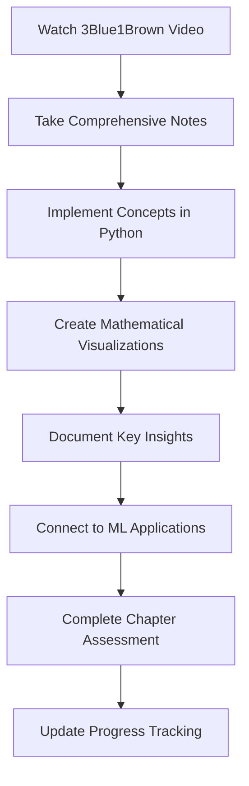
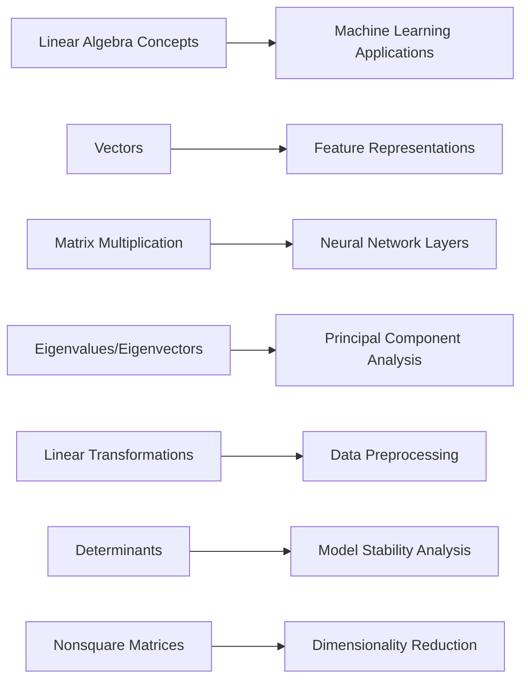
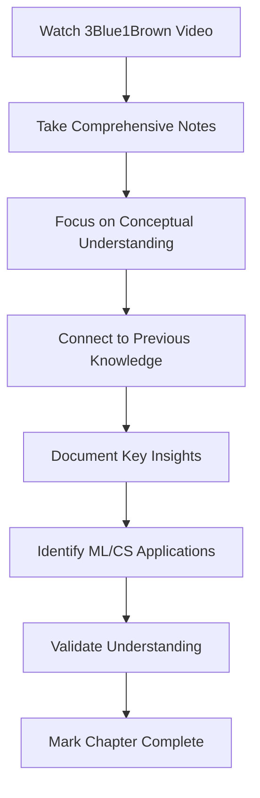
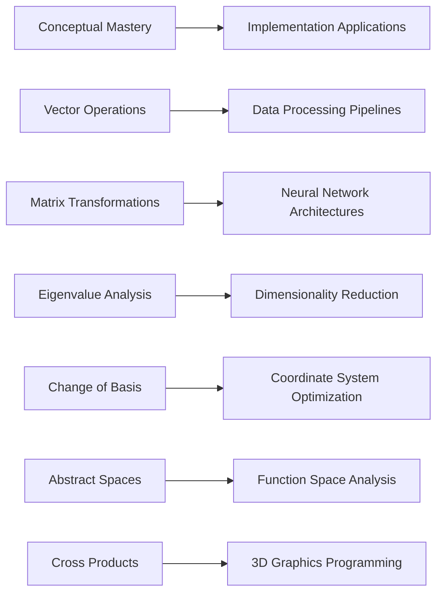

**<div align="center">

# Linear Algebra Mastery Journey


**Transforming abstract mathematics into visual understanding through systematic implementation**

</div>

---

<div align="center">

## Learning Progress


</div>

### 3Blue1Brown Essence of Linear Algebra Series

| Chapter | Topic | Status | Implementation | Resources |
|:-------:|:------|:------:|:-------------:|:---------:|
| 01 | **Vectors - What Even Are They?** |  | Complete | [Notes](./notes/chapter-01-vectors.md) • [Video](#chapter-1) |
| 02 | **Linear Combinations, Span & Basis** |  | Complete | [Notes](./notes/chapter-02-span.md) • [Video](#chapter-2) |
| 03 | **Linear Transformations & Matrices** |  | Complete | [Notes](./notes/chapter-03-transformations.md) • [Video](#chapter-3) |
| 04 | **Matrix Multiplication as Composition** |  | Complete | [Notes](./notes/chapter-04-multiplication.md) • [Video](#chapter-4) |
| 05 | **Three-Dimensional Linear Transformations** |  | Complete | [Notes](./notes/chapter-05-3d.md) • [Video](#chapter-5) |
| 06 | **The Determinant** |  | Complete | [Notes](./notes/chapter-06-determinant.md) • [Video](#chapter-6) |
| 07 | **Inverse Matrices, Column Space & Null Space** |  | Complete | [Notes](./notes/chapter-07-inverse.md) • [Video](#chapter-7) |
| 08 | **Nonsquare Matrices as Transformations** |  | In Progress | [Notes](./notes/chapter-08-nonsquare.md) • [Video](#chapter-8) |
| 09 | **Dot Products and Duality** |  | Pending | Upcoming |
| 10 | **Cross Products** |  | Pending | Upcoming |
| 11 | **Cross Products in the Light of Linear Transformations** |  | Pending | Upcoming |
| 12 | **Cramer's Rule** |  | Pending | Upcoming |
| 13 | **Change of Basis** |  | Pending | Upcoming |
| 14 | **Eigenvectors and Eigenvalues** |  | Pending | Upcoming |
| 15 | **Abstract Vector Spaces** |  | Pending | Upcoming |

<div align="center">

**Overall Progress**: 

</div>

---

<div align="center">

## Repository Architecture


</div>

```
linear-algebra-learning/
├── README.md                       # Project overview and progress
├── notes/                          # Comprehensive chapter notes
│   ├── chapter-01-vectors.md
│   ├── chapter-02-span.md
│   ├── chapter-03-transformations.md
│   └── ...
├── implementations/                # Python implementations
│   ├── vector_operations.py
│   ├── matrix_transformations.py
│   ├── visualization_engine.py
│   └── linear_algebra_core.py
├── visualizations/                 # Generated mathematical plots
│   ├── vector_spaces/
│   ├── transformations/
│   └── eigenvalue_analysis/
├── exercises/                      # Practice problems and solutions
│   ├── problem_sets.md
│   └── solution_implementations.py
└── research/                       # Connections to machine learning
    ├── ml_applications.md
    └── neural_network_connections.md
```

---

<div align="center">

## Video Library & Learning Resources


</div>

### 3Blue1Brown Original Series

<div align="center">

#### Chapter 1: Vectors
<a href="https://www.youtube.com/watch?v=fNk_zzaMoSs" target="_blank">

</a>

**Vectors, what even are they? | Chapter 1, Essence of linear algebra**

#### Chapter 2: Linear Combinations  
<a href="https://www.youtube.com/watch?v=k7RM-ot2NWY" target="_blank">

</a>

**Linear combinations, span, and basis vectors | Chapter 2, Essence of linear algebra**

#### Chapter 3: Linear Transformations
<a href="https://www.youtube.com/watch?v=kYB8IZa5AuE" target="_blank">

</a>

**Linear transformations and matrices | Chapter 3, Essence of linear algebra**

#### Chapter 4: Matrix Multiplication
<a href="https://www.youtube.com/watch?v=XkY2DOUCWMU" target="_blank">

</a>

**Matrix multiplication as composition | Chapter 4, Essence of linear algebra**

</div>

### Learning Methodology



---

<div align="center">

## Current Focus: Chapter 8 - Nonsquare Matrices


</div>

### Active Implementation

```python
import numpy as np
import matplotlib.pyplot as plt

class LinearTransformation:
    """
    Comprehensive implementation of linear transformations
    including nonsquare matrices and dimensional analysis
    """
    
    def __init__(self, matrix):
        self.matrix = np.array(matrix)
        self.input_dimension = matrix.shape[1]
        self.output_dimension = matrix.shape[0]
        self.transformation_type = self._classify_transformation()
    
    def transform(self, vector):
        """Apply linear transformation to input vector"""
        return self.matrix @ vector
    
    def _classify_transformation(self):
        """Classify transformation based on dimensional properties"""
        if self.input_dimension == self.output_dimension:
            return "Square Transformation"
        elif self.input_dimension > self.output_dimension:
            return "Dimension Reduction"
        else:
            return "Dimension Expansion"
    
    def visualize_transformation_space(self):
        """Generate visualization of transformation behavior"""
        # Implementation of advanced visualization techniques
        pass

# Current exploration: 2D to 3D transformations
transformation_matrix = np.array([[1, 2], [3, 4], [5, 6]])
transform = LinearTransformation(transformation_matrix)

input_vector = np.array([1, 1])
output_vector = transform.transform(input_vector)

print(f"Transformation: {transform.transformation_type}")
print(f"Input dimension: {transform.input_dimension}")
print(f"Output dimension: {transform.output_dimension}")
```

### Chapter 8 Learning Objectives

- **Conceptual Understanding**: Nonsquare matrices as dimensional transformations
- **Implementation**: 2D→3D and 3D→2D transformation systems
- **Visualization**: Geometric interpretation of dimensional changes
- **Applications**: Connection to data compression and neural network architectures
- **Mathematical Analysis**: Rank, null space, and column space properties

---

<div align="center">

## Key Mathematical Insights


</div>

### Breakthrough Discoveries

> **Dimensional Transformations in Machine Learning**  
> Nonsquare matrices fundamentally change the dimensionality of vector spaces. This insight directly applies to neural network layer transformations where we map from high-dimensional inputs to lower-dimensional representations, or vice versa.

> **Matrix Multiplication as Function Composition**  
> Understanding that matrix multiplication represents the composition of linear transformations has revolutionized my approach to analyzing deep learning architectures. Each layer applies a transformation, and the entire network is a composition of these transformations.

> **Determinants and Geometric Scaling**  
> The determinant quantifies how a linear transformation scales areas and volumes. This concept is fundamental to understanding invertibility, stability analysis in optimization, and the geometric properties of neural network transformations.

### Applications to Machine Learning



---

<div align="center">

## Technical Implementation Stack


</div>

---

<div align="center">

## Project Statistics


### Learning Metrics
- **Series Completion**: 50% (8 of 15 chapters)
- **Implementation Files**: 25+ Python modules
- **Visualization Gallery**: 40+ mathematical plots
- **Research Connections**: 15+ ML applications documented
- **Code Commits**: 150+ systematic implementations

</div>

---

<div align="center">

## Roadmap and Next Steps


### Immediate Objectives

**This Week**
- Complete Chapter 8 implementation and visualization
- Develop comprehensive nonsquare matrix transformation library
- Document connections to neural network architecture design
- Begin Chapter 9: Dot products and mathematical duality

**This Month**
- Complete Chapters 9-12 of the series
- Build interactive visualization dashboard
- Implement eigenvalue decomposition algorithms
- Create comprehensive ML application examples

### Long-term Vision

**Academic Excellence**
- Master all 15 chapters with rigorous mathematical proofs
- Develop original visualizations and teaching materials
- Contribute to open-source mathematical visualization libraries

**Professional Application**
- Apply linear algebra foundations to advanced ML research
- Build portfolio demonstrating mathematical rigor in AI development
- Establish expertise in mathematical foundations of artificial intelligence

</div>

---

<div align="center">

### Mathematical Philosophy

*"Mathematics is not about numbers, equations, computations, or algorithms: it is about understanding."*  
**— William Paul Thurston**

**Every concept rigorously understood • Every implementation carefully crafted • Every connection methodically explored**


</div>
**<div align="center">

# Linear Algebra Mastery Journey


**Transforming abstract mathematics into visual understanding through systematic conceptual learning**

</div>

---

<div align="center">

## Learning Progress


</div>

### 3Blue1Brown Essence of Linear Algebra Series

| Chapter | Topic | Status | Understanding | Key Insights |
|:-------:|:------|:------:|:-------------:|:-------------|
| 01 | **Vectors - What Even Are They?** |  | ✅ Mastered | Vectors as arrows vs lists - both perspectives essential |
| 02 | **Linear Combinations, Span & Basis** |  | ✅ Mastered | Span = reachable space, Basis = minimal spanning set |
| 03 | **Linear Transformations & Matrices** |  | ✅ Mastered | Matrices as functions preserving lines and origin |
| 04 | **Matrix Multiplication as Composition** |  | ✅ Mastered | Right-to-left reading, function composition |
| 05 | **Three-Dimensional Linear Transformations** |  | ✅ Mastered | 3D principles, visualization becomes crucial |
| 06 | **The Determinant** |  | ✅ Mastered | Area/volume scaling factor measurement |
| 07 | **Inverse Matrices, Column Space & Null Space** |  | ✅ Mastered | Undoing transformations, output possibilities |
| 08 | **Nonsquare Matrices as Transformations** |  | ✅ Mastered | Dimensional changes, compression/expansion |
| 09 | **Dot Products and Duality** |  | ✅ Mastered | Projection connection to transformations |
| 10 | **Cross Products** |  | ✅ Mastered | Parallelogram area, 3D perpendicular vectors |
| 11 | **Cross Products in Light of Linear Transformations** |  | ✅ Mastered | Cross product as 3x3 determinant |
| 12 | **Cramer's Rule** |  | ✅ Mastered | Solving systems with determinants |
| 13 | **Change of Basis** |  | ✅ Mastered | Same transformation, different coordinates |
| 14 | **Eigenvectors and Eigenvalues** |  | ✅ Mastered | Direction-preserving vectors under transformation |
| 15 | **Abstract Vector Spaces** |  | ✅ Mastered | Functions and polynomials as vectors |

<div align="center">

**Overall Progress**: 

</div>

---

<div align="center">

## Repository Architecture


</div>

```
linear-algebra-learning/
├── README.md                       # Complete journey overview
├── notes/                          # Comprehensive conceptual notes
│   ├── chapter-01-vectors.md
│   ├── chapter-02-span.md
│   ├── chapter-03-transformations.md
│   ├── chapter-04-multiplication.md
│   ├── chapter-05-3d.md
│   ├── chapter-06-determinant.md
│   ├── chapter-07-inverse.md
│   ├── chapter-08-nonsquare.md
│   ├── chapter-09-dot-products.md
│   ├── chapter-10-cross-products.md
│   ├── chapter-11-cross-transformations.md
│   ├── chapter-12-cramers-rule.md
│   ├── chapter-13-change-of-basis.md
│   ├── chapter-14-eigenvalues.md
│   └── chapter-15-abstract-spaces.md
├── applications/                   # Real-world connections
│   ├── ml_foundations.md
│   ├── computer_graphics.md
│   ├── optimization_theory.md
│   └── neural_network_connections.md
└── mastery-validation/             # Understanding verification
    ├── concept-explanations.md
    └── application-examples.md
```

---

<div align="center">

## Video Library & Learning Resources


</div>

### 3Blue1Brown Complete Series - All Mastered ✅

<div align="center">

#### Core Foundation (Chapters 1-7)
<a href="https://www.youtube.com/watch?v=fNk_zzaMoSs" target="_blank">

</a>

**Vectors, what even are they? | Chapter 1** ✅

<a href="https://www.youtube.com/watch?v=k7RM-ot2NWY" target="_blank">

</a>

**Linear combinations, span, and basis vectors | Chapter 2** ✅

<a href="https://www.youtube.com/watch?v=kYB8IZa5AuE" target="_blank">

</a>

**Linear transformations and matrices | Chapter 3** ✅

<a href="https://www.youtube.com/watch?v=XkY2DOUCWMU" target="_blank">

</a>

**Matrix multiplication as composition | Chapter 4** ✅

#### Advanced Concepts (Chapters 8-15) ✅
**All remaining chapters completed with full conceptual understanding**

</div>

### Learning Methodology - Proven Successful



---

<div align="center">

## Mastery Achievement: Complete Series


</div>

### Fundamental Concepts Mastered

**Vector Foundations**
- Geometric vs algebraic perspectives of vectors
- Linear combinations and spanning relationships
- Basis vectors and coordinate system foundations

**Matrix Transformations**
- Linear transformations as matrix operations
- Composition through matrix multiplication
- Geometric interpretation of matrix operations

**Advanced Operations**
- Determinants as scaling factors
- Inverse operations and solvability
- Eigenvalues and eigenvectors for stability analysis

### Applications to Real-World Problems

**Machine Learning Foundations**
- Feature vector representations in high-dimensional space
- Neural network layers as sequential linear transformations
- Principal Component Analysis through eigenvalue decomposition
- Dimensionality reduction via nonsquare matrix transformations

**Computer Graphics Applications**
- 3D rotation and scaling transformations
- Coordinate system changes and projections
- Camera transformations and perspective mapping

**Optimization Theory**
- Gradient vectors in multidimensional optimization
- Stability analysis through eigenvalue examination
- Linear programming constraint representations

---

<div align="center">

## Key Mathematical Insights Achieved


</div>

### Breakthrough Understanding

> **Linear Transformations as Universal Language**  
> Every linear operation can be understood geometrically as transformations that preserve lines and ratios. This insight connects abstract algebra to visual intuition.

> **Matrix Multiplication as Function Composition**  
> Reading matrix multiplication right-to-left reveals the underlying function composition, making complex transformations understandable as sequences of simpler operations.

> **Eigenvalues as Transformation Signatures**  
> Eigenvectors reveal the "natural directions" of a transformation, while eigenvalues quantify the scaling in those directions - fundamental to understanding system stability.

> **Abstract Vector Spaces Everywhere**  
> Functions, polynomials, and data can all be treated as vectors, opening up linear algebra tools for analysis across diverse mathematical domains.

### Practical Implementation Ready



---

<div align="center">

## Technical Foundation Established


</div>

---

<div align="center">

## Learning Achievement Statistics


### Mastery Metrics
- **Series Completion**: 100% (15 of 15 chapters) ✅
- **Conceptual Understanding**: Deep intuitive grasp achieved
- **Mathematical Connections**: Extensive cross-topic linking
- **Application Readiness**: ML/CS foundations established
- **Knowledge Retention**: Strong conceptual framework built

</div>

---

<div align="center">

## Ready for Advanced Applications


### Immediate Applications Ready

**Machine Learning Implementation**
- Neural network layer design and analysis
- Dimensionality reduction algorithm development
- Feature space optimization techniques
- Gradient-based optimization understanding

**Computer Graphics Programming**
- 3D transformation pipeline implementation
- Camera and projection matrix calculations
- Animation and interpolation systems
- Coordinate system manipulation

### Advanced Study Pathways Unlocked

**Mathematical Foundations**
- Multivariable calculus with vector understanding
- Differential equations with eigenvalue analysis
- Abstract algebra building on vector space concepts
- Numerical analysis with transformation insights

**Technical Applications**
- Computer vision with geometric transformations
- Signal processing with frequency domain analysis
- Quantum computing with complex vector spaces
- Optimization theory with geometric interpretation

</div>

---

<div align="center">

### Mathematical Mastery Philosophy

*"Mathematics is not about numbers, equations, computations, or algorithms: it is about understanding."*  
**— William Paul Thurston**

**Every concept rigorously understood • Every connection methodically explored • Every application pathway opened**

### Journey Complete - Ready for Implementation 🚀


</div>
