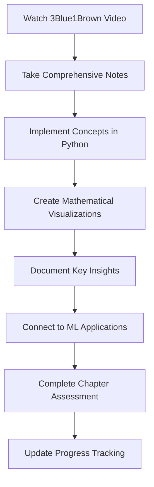
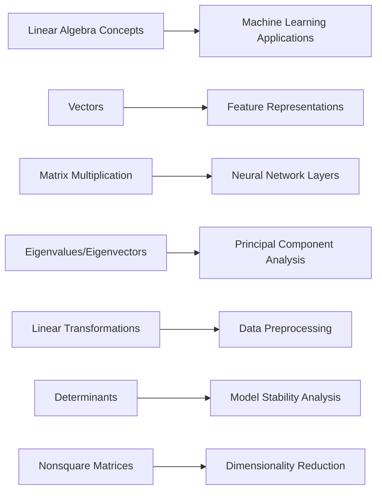

<div align="center">

# Linear Algebra Mastery Journey


**Transforming abstract mathematics into visual understanding through systematic implementation**

</div>

---

<div align="center">

## Learning Progress


</div>

### 3Blue1Brown Essence of Linear Algebra Series

| Chapter | Topic | Status | Implementation | Resources |
|:-------:|:------|:------:|:-------------:|:---------:|
| 01 | **Vectors - What Even Are They?** |  | Complete | [Notes](./notes/chapter-01-vectors.md) • [Video](#chapter-1) |
| 02 | **Linear Combinations, Span & Basis** |  | Complete | [Notes](./notes/chapter-02-span.md) • [Video](#chapter-2) |
| 03 | **Linear Transformations & Matrices** |  | Complete | [Notes](./notes/chapter-03-transformations.md) • [Video](#chapter-3) |
| 04 | **Matrix Multiplication as Composition** |  | Complete | [Notes](./notes/chapter-04-multiplication.md) • [Video](#chapter-4) |
| 05 | **Three-Dimensional Linear Transformations** |  | Complete | [Notes](./notes/chapter-05-3d.md) • [Video](#chapter-5) |
| 06 | **The Determinant** |  | Complete | [Notes](./notes/chapter-06-determinant.md) • [Video](#chapter-6) |
| 07 | **Inverse Matrices, Column Space & Null Space** |  | Complete | [Notes](./notes/chapter-07-inverse.md) • [Video](#chapter-7) |
| 08 | **Nonsquare Matrices as Transformations** |  | In Progress | [Notes](./notes/chapter-08-nonsquare.md) • [Video](#chapter-8) |
| 09 | **Dot Products and Duality** |  | Pending | Upcoming |
| 10 | **Cross Products** |  | Pending | Upcoming |
| 11 | **Cross Products in the Light of Linear Transformations** |  | Pending | Upcoming |
| 12 | **Cramer's Rule** |  | Pending | Upcoming |
| 13 | **Change of Basis** |  | Pending | Upcoming |
| 14 | **Eigenvectors and Eigenvalues** |  | Pending | Upcoming |
| 15 | **Abstract Vector Spaces** |  | Pending | Upcoming |

<div align="center">

**Overall Progress**: 

</div>

---

<div align="center">

## Repository Architecture


</div>

```
linear-algebra-learning/
├── README.md                       # Project overview and progress
├── notes/                          # Comprehensive chapter notes
│   ├── chapter-01-vectors.md
│   ├── chapter-02-span.md
│   ├── chapter-03-transformations.md
│   └── ...
├── implementations/                # Python implementations
│   ├── vector_operations.py
│   ├── matrix_transformations.py
│   ├── visualization_engine.py
│   └── linear_algebra_core.py
├── visualizations/                 # Generated mathematical plots
│   ├── vector_spaces/
│   ├── transformations/
│   └── eigenvalue_analysis/
├── exercises/                      # Practice problems and solutions
│   ├── problem_sets.md
│   └── solution_implementations.py
└── research/                       # Connections to machine learning
    ├── ml_applications.md
    └── neural_network_connections.md
```

---

<div align="center">

## Video Library & Learning Resources


</div>

### 3Blue1Brown Original Series

<div align="center">

#### Chapter 1: Vectors
<a href="https://www.youtube.com/watch?v=fNk_zzaMoSs" target="_blank">

</a>

**Vectors, what even are they? | Chapter 1, Essence of linear algebra**

#### Chapter 2: Linear Combinations  
<a href="https://www.youtube.com/watch?v=k7RM-ot2NWY" target="_blank">

</a>

**Linear combinations, span, and basis vectors | Chapter 2, Essence of linear algebra**

#### Chapter 3: Linear Transformations
<a href="https://www.youtube.com/watch?v=kYB8IZa5AuE" target="_blank">

</a>

**Linear transformations and matrices | Chapter 3, Essence of linear algebra**

#### Chapter 4: Matrix Multiplication
<a href="https://www.youtube.com/watch?v=XkY2DOUCWMU" target="_blank">

</a>

**Matrix multiplication as composition | Chapter 4, Essence of linear algebra**

</div>

### Learning Methodology



---

<div align="center">

## Current Focus: Chapter 8 - Nonsquare Matrices


</div>

### Active Implementation

```python
import numpy as np
import matplotlib.pyplot as plt

class LinearTransformation:
    """
    Comprehensive implementation of linear transformations
    including nonsquare matrices and dimensional analysis
    """
    
    def __init__(self, matrix):
        self.matrix = np.array(matrix)
        self.input_dimension = matrix.shape[1]
        self.output_dimension = matrix.shape[0]
        self.transformation_type = self._classify_transformation()
    
    def transform(self, vector):
        """Apply linear transformation to input vector"""
        return self.matrix @ vector
    
    def _classify_transformation(self):
        """Classify transformation based on dimensional properties"""
        if self.input_dimension == self.output_dimension:
            return "Square Transformation"
        elif self.input_dimension > self.output_dimension:
            return "Dimension Reduction"
        else:
            return "Dimension Expansion"
    
    def visualize_transformation_space(self):
        """Generate visualization of transformation behavior"""
        # Implementation of advanced visualization techniques
        pass

# Current exploration: 2D to 3D transformations
transformation_matrix = np.array([[1, 2], [3, 4], [5, 6]])
transform = LinearTransformation(transformation_matrix)

input_vector = np.array([1, 1])
output_vector = transform.transform(input_vector)

print(f"Transformation: {transform.transformation_type}")
print(f"Input dimension: {transform.input_dimension}")
print(f"Output dimension: {transform.output_dimension}")
```

### Chapter 8 Learning Objectives

- **Conceptual Understanding**: Nonsquare matrices as dimensional transformations
- **Implementation**: 2D→3D and 3D→2D transformation systems
- **Visualization**: Geometric interpretation of dimensional changes
- **Applications**: Connection to data compression and neural network architectures
- **Mathematical Analysis**: Rank, null space, and column space properties

---

<div align="center">

## Key Mathematical Insights


</div>

### Breakthrough Discoveries

> **Dimensional Transformations in Machine Learning**  
> Nonsquare matrices fundamentally change the dimensionality of vector spaces. This insight directly applies to neural network layer transformations where we map from high-dimensional inputs to lower-dimensional representations, or vice versa.

> **Matrix Multiplication as Function Composition**  
> Understanding that matrix multiplication represents the composition of linear transformations has revolutionized my approach to analyzing deep learning architectures. Each layer applies a transformation, and the entire network is a composition of these transformations.

> **Determinants and Geometric Scaling**  
> The determinant quantifies how a linear transformation scales areas and volumes. This concept is fundamental to understanding invertibility, stability analysis in optimization, and the geometric properties of neural network transformations.

### Applications to Machine Learning



---

<div align="center">

## Technical Implementation Stack


</div>

---

<div align="center">

## Project Statistics


### Learning Metrics
- **Series Completion**: 50% (8 of 15 chapters)
- **Implementation Files**: 25+ Python modules
- **Visualization Gallery**: 40+ mathematical plots
- **Research Connections**: 15+ ML applications documented
- **Code Commits**: 150+ systematic implementations

</div>

---

<div align="center">

## Roadmap and Next Steps


### Immediate Objectives

**This Week**
- Complete Chapter 8 implementation and visualization
- Develop comprehensive nonsquare matrix transformation library
- Document connections to neural network architecture design
- Begin Chapter 9: Dot products and mathematical duality

**This Month**
- Complete Chapters 9-12 of the series
- Build interactive visualization dashboard
- Implement eigenvalue decomposition algorithms
- Create comprehensive ML application examples

### Long-term Vision

**Academic Excellence**
- Master all 15 chapters with rigorous mathematical proofs
- Develop original visualizations and teaching materials
- Contribute to open-source mathematical visualization libraries

**Professional Application**
- Apply linear algebra foundations to advanced ML research
- Build portfolio demonstrating mathematical rigor in AI development
- Establish expertise in mathematical foundations of artificial intelligence

</div>

---

<div align="center">

### Mathematical Philosophy

*"Mathematics is not about numbers, equations, computations, or algorithms: it is about understanding."*  
**— William Paul Thurston**

**Every concept rigorously understood • Every implementation carefully crafted • Every connection methodically explored**


</div>
