<div align="center">

# 🧮 Linear Algebra Mastery Journey


**Transforming abstract mathematics into visual understanding through hands-on implementation**

</div>

---

<div align="center">

## 🎥 Video Library & Learning Resources


</div>

### 📺 3Blue1Brown Original Series

<div align="center">

#### Chapter 1 Video
<a href="https://www.youtube.com/watch?v=fNk_zzaMoSs" target="_blank">

</a>

**Vectors, what even are they? | Chapter 1, Essence of linear algebra**

#### Chapter 2 Video  
<a href="https://www.youtube.com/watch?v=k7RM-ot2NWY" target="_blank">

</a>

**Linear combinations, span, and basis vectors | Chapter 2, Essence of linear algebra**

#### Chapter 3 Video
<a href="https://www.youtube.com/watch?v=kYB8IZa5AuE" target="_blank">

</a>

**Linear transformations and matrices | Chapter 3, Essence of linear algebra**

#### Chapter 4 Video
<a href="https://www.youtube.com/watch?v=XkY2DOUCWMU" target="_blank">

</a>

**Matrix multiplication as composition | Chapter 4, Essence of linear algebra**

</div>

### 🎯 My Learning Process

```mermaid
graph TD
    A[📺 Watch 3Blue1Brown Video] --> B[📝 Take Detailed Notes]
    B --> C[💻 Implement in Python]
    C --> D[🎨 Create Visualizations]
    D --> E[🧠 Write Key Insights]
    E --> F[🔗 Connect to ML Applications]
    F --> G[✅ Mark Complete]
    G --> H[📊 Update Progress]
```



---

<div align="center">

## 🎯 Learning Progress


</div>

### 📚 3Blue1Brown Essence of Linear Algebra Series

| Chapter | Topic | Status | Implementation | Notes |
|:-------:|:------|:------:|:-------------:|:-----:|
| 01 | **Vectors - What Even Are They?** |  | ✅ | [ğŸ“](./notes/chapter-01-vectors.md) [🎥](#chapter-1-video) |
| 02 | **Linear Combinations, Span & Basis** |  | ✅ | [ğŸ“](./notes/chapter-02-span.md) [🎥](#chapter-2-video) |
| 03 | **Linear Transformations & Matrices** |  | ✅ | [ğŸ“](./notes/chapter-03-transformations.md) [🎥](#chapter-3-video) |
| 04 | **Matrix Multiplication as Composition** |  | ✅ | [ğŸ“](./notes/chapter-04-multiplication.md) [🎥](#chapter-4-video) |
| 05 | **Three-Dimensional Linear Transformations** |  | ✅ | [ğŸ“](./notes/chapter-05-3d.md) [🎥](#chapter-5-video) |
| 06 | **The Determinant** |  | ✅ | [ğŸ“](./notes/chapter-06-determinant.md) [🎥](#chapter-6-video) |
| 07 | **Inverse Matrices, Column Space & Null Space** |  | ✅ | [ğŸ“](./notes/chapter-07-inverse.md) [🎥](#chapter-7-video) |
| 08 | **Nonsquare Matrices as Transformations** |  | 🔄 | [ğŸ“](./notes/chapter-08-nonsquare.md) [🎥](#chapter-8-video) |
| 09 | **Dot Products and Duality** |  | ⏳ | ⏳ |
| 10 | **Cross Products** |  | ⏳ | ⏳ |
| 11 | **Cross Products in the Light of Linear Transformations** |  | ⏳ | ⏳ |
| 12 | **Cramer's Rule** |  | ⏳ | ⏳ |
| 13 | **Change of Basis** |  | ⏳ | ⏳ |
| 14 | **Eigenvectors and Eigenvalues** |  | ⏳ | ⏳ |
| 15 | **Abstract Vector Spaces** |  | ⏳ | ⏳ |

<div align="center">

**Overall Progress**: 

</div>

---

<div align="center">

## 🗂️ Repository Structure


</div>

```
📦 linear-algebra-learning/
├── 📋 README.md                    # This overview
├── 📝 notes/                       # Chapter-by-chapter notes
│   ├── 📄 chapter-01-vectors.md
│   ├── 📄 chapter-02-span.md
│   └── 📄 ...
├── 💻 implementations/             # Python code implementations
│   ├── 🐍 vector_operations.py
│   ├── 🐍 matrix_transformations.py
│   ├── 🐍 visualizations.py
│   └── 🐍 ...
├── 🎨 visualizations/              # Generated plots and animations
│   ├── 🖼️ vector_addition.png
│   ├── 🎬 linear_transformation.gif
│   └── 🖼️ ...
├── 🧪 exercises/                   # Practice problems & solutions
│   ├── 📝 practice_problems.md
│   └── 🐍 solutions.py
└── 💡 insights/                    # Key learnings & aha moments
    ├── 📄 breakthrough_moments.md
    └── 📄 connections_to_ml.md
```

---

<div align="center">

## 🎨 Current Focus: Chapter 8 - Nonsquare Matrices


</div>

### 🔥 What I'm Working On Right Now

```python
# 🚀 Latest Implementation: Nonsquare Matrix Transformations
import numpy as np
import matplotlib.pyplot as plt

class LinearTransformation:
    def __init__(self, matrix):
        self.matrix = np.array(matrix)
        self.input_dim = matrix.shape[1]
        self.output_dim = matrix.shape[0]
    
    def transform(self, vector):
        """Apply transformation to vector"""
        return self.matrix @ vector
    
    def visualize_transformation(self, input_space, output_space):
        """Visualize how transformation maps between spaces"""
        # From 2D to 3D or 3D to 2D - mind-blowing! 🤯
        pass

# Understanding dimension changes through linear algebra! 
nonsquare = LinearTransformation([[1, 2], [3, 4], [5, 6]])  # 2D → 3D
result = nonsquare.transform([1, 1])  # Magic dimensionality! ✨
```

### 🎯 Chapter 8 Objectives
- [x] **Understand nonsquare matrices conceptually** 📐
- [x] **Implement 2D→3D and 3D→2D transformations** ➕
- [ ] **Visualize dimension changes** 🎨
- [ ] **Connect to data compression & expansion** 📊
- [ ] **Link to neural network layers** 🤖

---

<div align="center">

## 🧠 Key Insights & Breakthrough Moments


</div>

### 💡 Latest "Aha!" Moments

> **🔥 Nonsquare matrices change dimensions!**  
> Just realized that when we multiply a 3×2 matrix by a 2D vector, we get a 3D vector! This is how neural networks transform data between layers! 🤯

> **⚡ Matrix multiplication is function composition**  
> Each matrix is like a function that transforms space. When we multiply matrices, we're composing transformations. This completely changed how I see deep learning architectures!

> **🚀 Determinants measure "scaling factor"**  
> The determinant tells us how much a transformation scales areas/volumes. Negative determinants flip orientation. This is crucial for understanding invertibility!

### 🔗 Connections to Machine Learning


---

<div align="center">

## 🛠️ Tools & Technologies


</div>

---

<div align="center">

## 📈 Learning Stats


### 🎯 Goals
- **Complete 3Blue1Brown series**: 15 chapters
- **Build 50+ implementations**: Hands-on coding
- **Create 20+ visualizations**: Make math beautiful
- **Write comprehensive notes**: Knowledge retention
- **Connect to 10+ ML applications**: Practical relevance

</div>

---

<div align="center">

## 🚀 Next Steps


### 📅 This Week
- [ ] Complete Chapter 1 implementation
- [ ] Create vector addition visualization
- [ ] Start Chapter 2: Linear combinations
- [ ] Write detailed notes on span and basis

### 🎯 This Month
- [ ] Master first 5 chapters
- [ ] Build comprehensive visualization library
- [ ] Create interactive demos
- [ ] Start connecting concepts to ML algorithms

</div>

---

<div align="center">

### 💭 Learning Philosophy

*"Mathematics is not about numbers, equations, computations, or algorithms: it is about understanding."* - William Paul Thurston

**Every concept implemented • Every visualization created • Every connection made**


</div>
